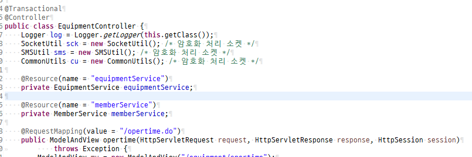

category: Dev  
tags: [spring, transaction]  

외주 맡긴 프로젝트인데 컨트롤러에서 여러 개의 쿼리를 사용하고 있어  
당연히 트랜젝션이 걸린 줄 알았는데 최근 발생한 장애 분석결과  
한 컨트롤메서드에서 쿼리 1- 2-3 으로 순차 insert하는 중 2번 테이블 insert eror가  
발생했으나 1번에는 insert 되는 현상으로 쉽게 말해 트랜젝션 설정이 안되있는 상태….  

스프링이 이럴리 없어 하고 찾아보니 역시나 아무런 세팅도 안되있다….  
이참에  스프링 트렌젝션 처리 방법을 정리하자.   
막상 편리한 프레임워크라곤 하는데 스프링 특성상 한가지 방식에 대한   
여러 구현 방법이 존재하는 식이고(어노테이션, 별도 빈 설정 등등등)   
내가 익숙하진 않으니 제일 간단한 어노테이션방식.  


일단 선 요약  
    1. (프로젝트마다 조금씩 위치는 다를 수 있겠지만  
    Spring-ibatis 기준으로 Db데이터 소스 연결하는 )스프링 컨피그에  
    transactionManager bean과 tx:annotation 추가.  
    2. 필요한 부분(메서드나 클래스나)에 @Transactional 어노테이션 추가.  


본인경우에는 context-datasource.xml 이고 설정상 context-*가 설정 xml로 등록되어  
있기도 하고(web.xml 에 다음과 같이 등록한 상태임)  

```
<context-param>
        <param-name>contextConfigLocation</param-name>
        <param-value>classpath*:config/spring/context-*.xml</param-value>
    </context-param>
```

운영/개발/테스트별로 datasource파일이 개별이라 별도로 context-datasource.xml을   
생성해서 아래와 같이 저장했다.  
```
<?xml version="1.0" encoding="UTF-8"?>
<beans xmlns="http://www.springframework.org/schema/beans"
        xmlns:xsi="http://www.w3.org/2001/XMLSchema-instance" 
        xmlns:tx="http://www.springframework.org/schema/tx"
        xsi:schemaLocation="
    http://www.springframework.org/schema/beans
    http://www.springframework.org/schema/beans/spring-beans-3.0.xsd
    http://www.springframework.org/schema/tx
    http://www.springframework.org/schema/tx/spring-tx-3.0.xsd">

        <bean id="transactionManager"
                class="org.springframework.jdbc.datasource.DataSourceTransactionManager">
                <property name="dataSource" ref="dataSource" />
        </bean>
        <tx:annotation-driven transaction-manager="transactionManager"
                proxy-target-class="true" />
</beans>
```

그리고나서 리퀘스트 매핑이 있는 컨트롤러 중 원하는 부분(클래스나 메서드)에   
@Transational 어노테이션 추가.  
본인은 클래스 전체에 걸어주었다.  


테스트해보니 에러나면 입력이 전체 롤백 됨 확인.  
