category: review
tags: [리뷰, 니콘 D750, 콜럼버스GPS]

저는 니콘 DSLR D750 유저입니다. 
딱히 필수는 아니지만 요새 스마트폰 사진이 많이 보편화 됬고 기능적으로 gps를 자동으로 잡아주는 기능이 있지만 DSLR은 별도 악세사리를 달아야지 GPS 기록이 가능합니다. 

사실 필요하다기 보단 업무스트레스떄문인지 지름신이 오신 바람에 좀 알아봤는데 니콘 정품은 가격이 심각하기 떄문에(...) 서드파티로 추천하는 몇몇 gps도 꽤 가격도 나가고 일단 의외로 d750가 지원된다고 써있는 gps가 없더군요(왜죠)

그러나 갓리익스프레스에 좀 서핑을 해보니 그 어디에도 리뷰가 없는, 그러나 d750된다고 써있는, 다른 제품의 반값에 가까운 가격의 이 제품을 발견해서 '좋아 돈 버려보자'라는 마음으로 구매했습니다.
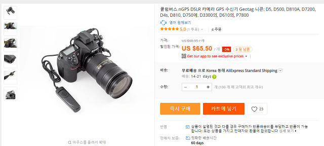
[구매한 곳 링크](https://ko.aliexpress.com/item/Columbus-nGPS-for-DSLR-Camera-GPS-Receiver-Geotag-for-Nikon-D5-D500-D810A-D7200-D4s-D810/32792553601.html)
19일 구매후 딱 10일만에 도착했습니다. 
퇴근 후 집에 오자마자 뜯어서 테스트를 위해 살짝 나갔다 왔기 떄문에 개봉기따윈 없습니다. 
구매 직후 테스트 후기 정도로 봐주시면 될거 같습니다. 
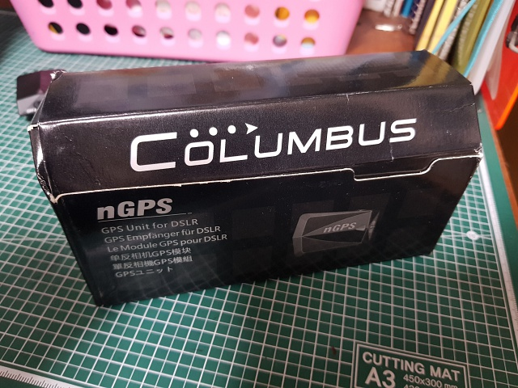
뭐 이런 박스에 들어져 있었구요. 

나름 영어, 중국어, 독일어, 일본어로 된 사용 설명서 입니다.

구성품은 아래와 같이 있습니다.(사진은 그 아래에 설명과 함께 첨부)
1. 본체, 
2. 케이블 2종(아마 카메라 모델에 따라 다른 듯), 
3. 핸드스트랩으로 보이는 스트랩, 
4. 유선릴리즈(카메라 릴리즈 소켓에 연결하므로 자체 유선 릴리즈가 포함되 있었습니다.), 
5. 스트랩 결합 모듈(카메라 스트랩쪽에 결합하는 부품.)

이하 본문은 구성품(사진) 설명, 사용법, 1시간 사용 후 확인한 기능들(장단점?) 순으로 적겠습니다. 

#### 구성품
1. 본체 
    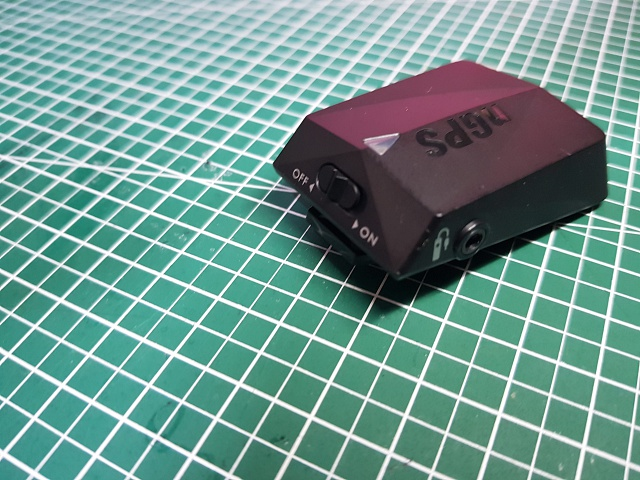
    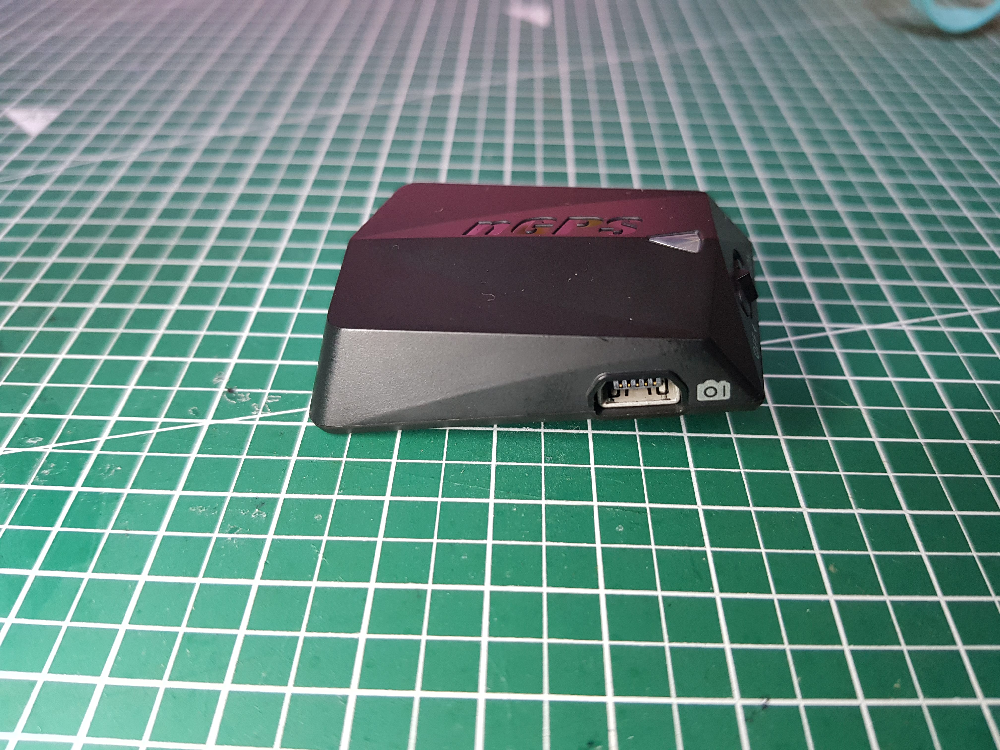
    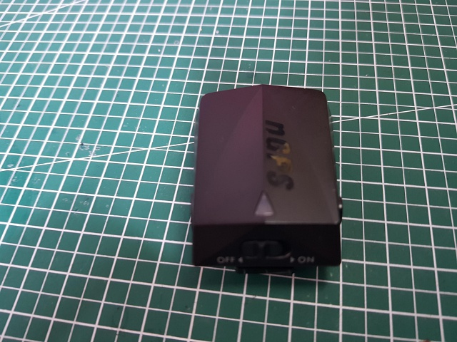
    이렇게 생겼습니다. 플라스틱 제질인데 그다지 고급스러워보이는 재질은 아닙니다. 
    상단에 로고와 led 좌우로 카메라 연결잭,릴리즈연결잭, 후변에 전원이 존재 합니다. 하단이야 슈연결부니 생략.
2. 케이블
    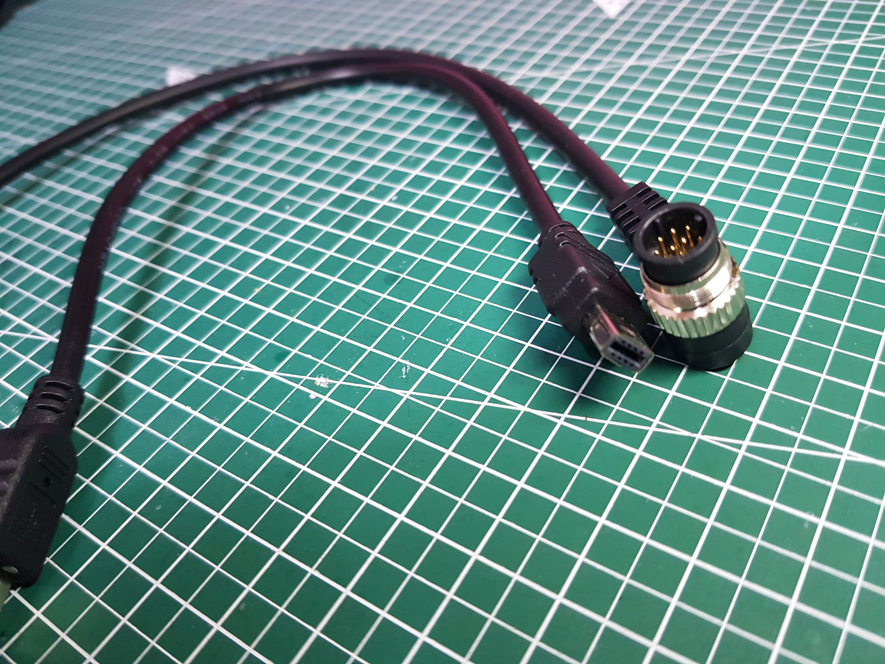
    옆에 네모잭이 D750에 맞는 잭입니다. 옆의 원형잭은 다른 카메라겠죠 설명서 상 구분은 되어있습니다.
3. 스트랩
    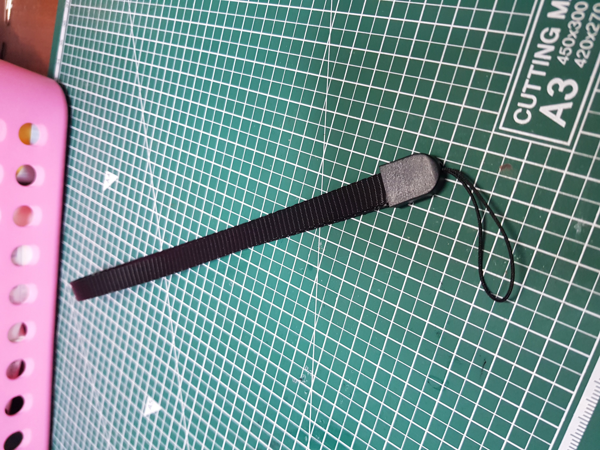
    어디에 연결하는지 모르겠습니다(...) 
    하단 슈 연결부분 뒤에 살짝 구멍이 있는데 여기에 연결해야하나.... 슈 아니면 넥스트랩에 결합하는데 이게 왜 필요하지...
4. 유선릴리즈
    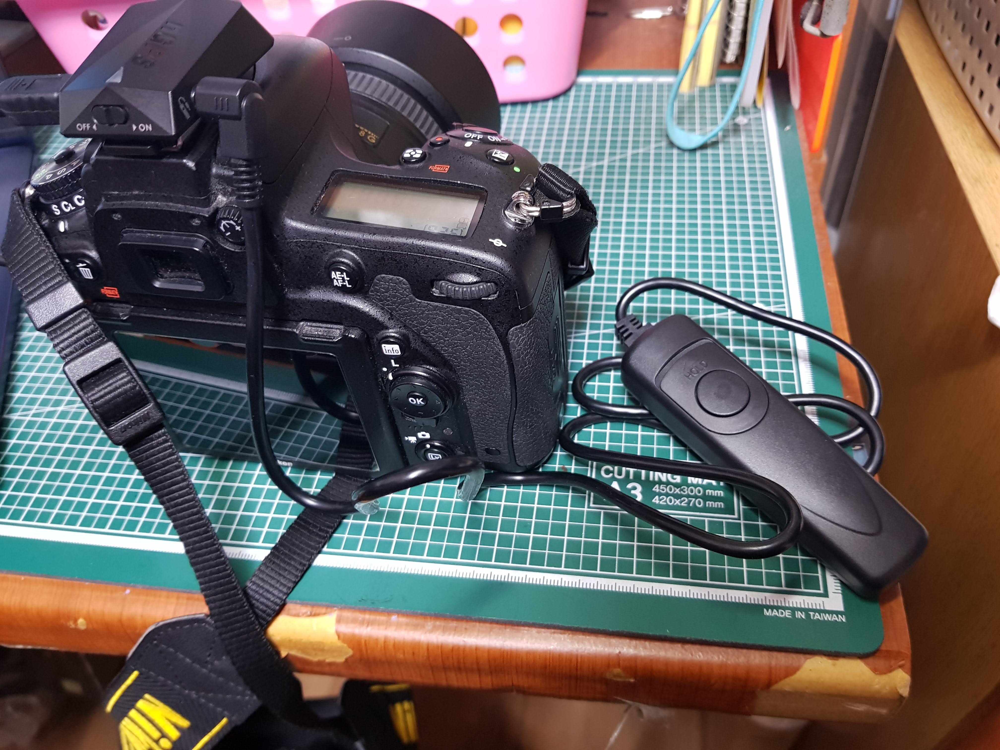
    역시 싸구려처럼 + 약해보이는 플라스틱 재질인데 기능은 정상적으로 하네요. 버튼을 누르고 앞으로 살짝 밀면(사진의 hold) 고정이 됩니다. 초점 락기능인줄 알았는데 고정되는 정도로 누르면 사진이 찍혀서 bulb용으로 보입니다.(메뉴얼에도 그렇게 되있음) 
5. 결합모듈
    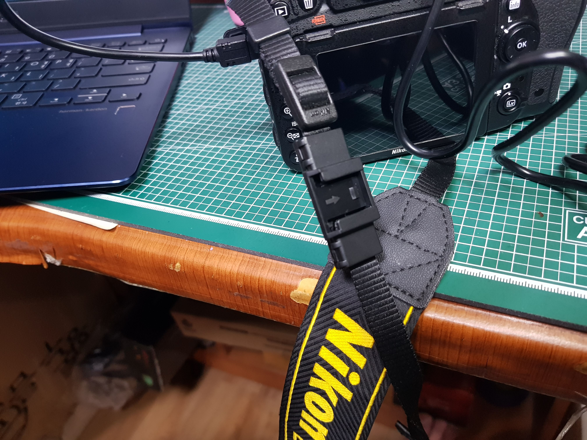    
    이렇게 넥스트랩에 결합해서 
    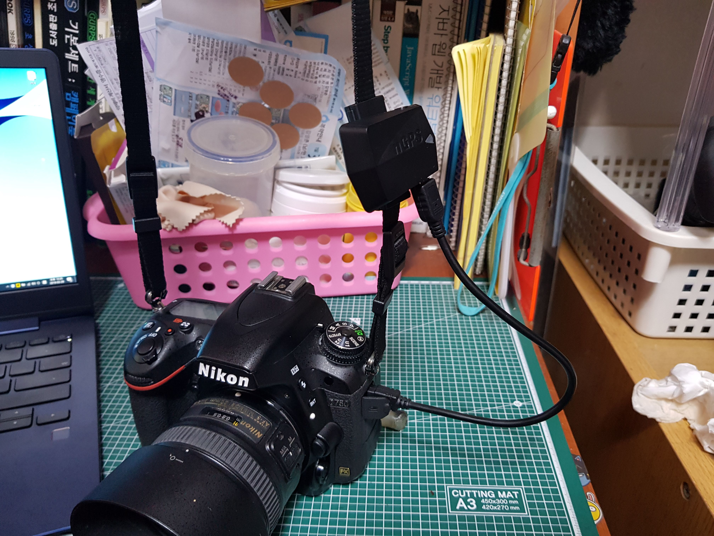
    이렇게 GPS모듈을 넥스트랩에 결합할 수 있습니다. 
    스피드라이트 등 슈를 써야하는 상황이나 취향껏 사용하면 될 듯 합니다. 
    결합 전 사진이 없는 이유는 저게 한번 닫으면 생각보다 심하게 꽉 물려버리는데
    처음에 반대로 껴버렸습니다(...) 
    뺴려고 힘줘서 뜯으니 그대로 결합힌지가 부러져버려서(이것도 엄청 약해보이는 재질인데 역시나) 그냥 순간접착제로 붙여버렸습니다. 그래도 넥스트랩에서 위아래로는 자유롭게 움직입니다(....)

#### 사용법
    1. 연결
    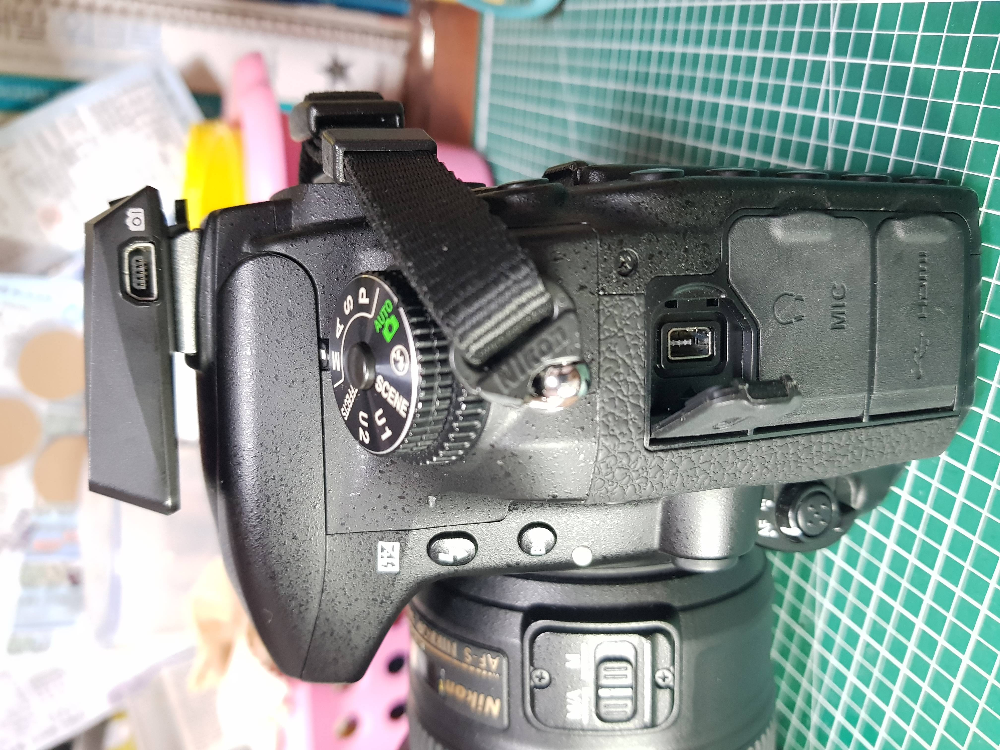    
    위와같이 슈연결하시고
    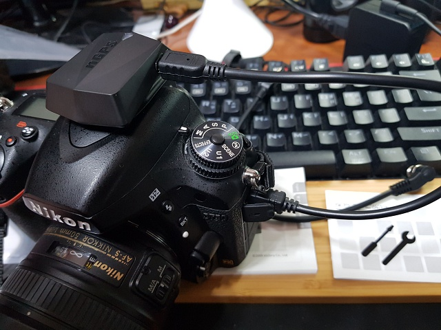
    케이블 꼽으시면 됩니다. d750용 릴리즈잭은 홈으로 방향이 고정되있으므로 주의!
    2. 켜기
    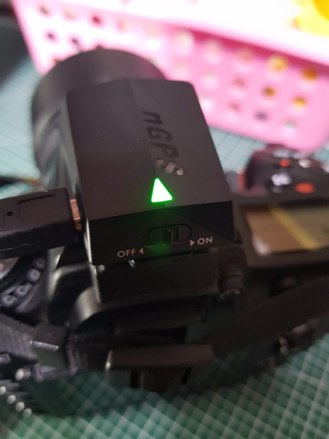
    그 후에 전원을 on 하시면 상단 led가 녹색으로 깜박이기 시작합니다.
    led 상태는
    꺼짐(off), 깜박임(GPS찾는중. 인식 안됨), 켜짐(GPS 잡음)
    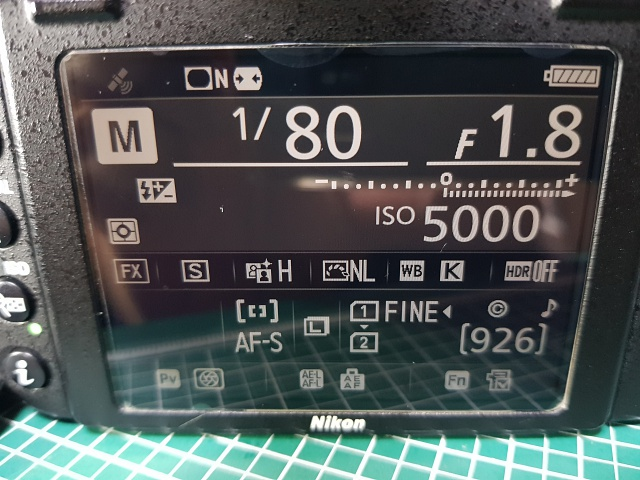
    d750의 경우 상단 액정에는 GPS 표시가 없고 lcd info를 누르시면 좌상단에 위성이 표시됩니다. 
    GPS모듈 led가 깜박이는 상황에서는 위성도 똑같이 깜박입니다.
    3. 사용하기
    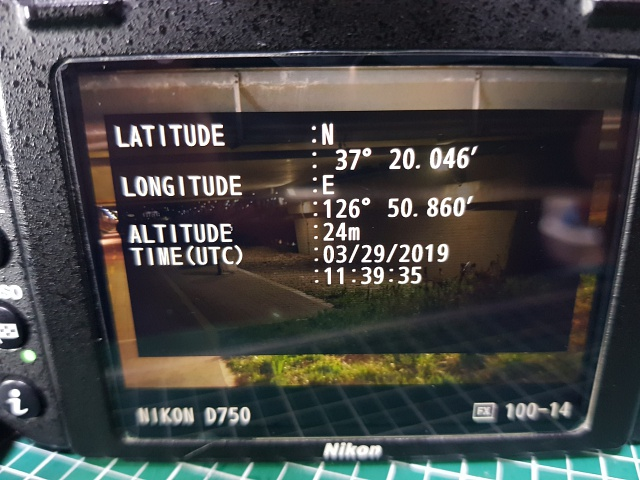
    실외에서 녹색 불이 들어온 상태에서 그냥 촬영하시면 사진에 자동으로 기록됩니다. 
#### 1시간 사용 후 확인한 기능들
    집 근처 개천을 돌면서 사진을 찍어보았습니다.  
    - 찾을 수 있는 정보(d750 GPS로 검색하는 모델들)에 비해서 저렴함.
    - 위 정보로 검색한 애들 중 아직도 판매중임...(일부 사이트 조차 없는 경우가 있었습니다)
    - 일단 잘 동작하는 걸로 보입니다. 찍은 사진을 구글포토등에 올려서 지도에 찍어보면 촬영위치대로 지도 마커가 잘 움직이네요
    - 위/경도와 고도, UTC 타임을 상세정보로 제공합니다.(d750의 heading 정보는 없다고 나옵니다. 메뉴얼에도 미제공이라 되있고요.) 
    - 카메라와 연결만 되있으면 카메라 전원과 독립적으로 켜집니다. 즉 카메라를 꺼도 GPS가 작동중이란건데 사진 찍을떄만 전원을 키는 저로선 괜찮은 기능입니다.
    - 다른 GPS 모듈은 GPS가 잡히지 않는 경우 직전에 잡았던 정보가 기록된다 하였는데 이 녀석은 안됩니다. 불 깜박거릴땐 GPS정보가 없습니다... 별거 아닌데 의외로 불편할 것 같습니다. 
    실외에서 끄지 않고 실내로 막 들어갔을때야 신호가 연결중이니 기록이 되지만 곧 깜박이기 시작하고 사진에 GPS기록이 되지 않습니다. 약간의 캐싱도 되지 않는게 많이 아쉽네요  
    - 소소한 건데 메뉴얼에 d750이 가능 모델로 안써있습니다.(엥????) 판매자 사이트에 기록된걸 기준으로 샀는데 사기가 아니라 다행(...)
    - 사고나서 생각컨데 케이블만 맞으면 d750 가능이라고 안써있는 다른 더 저렴한 물건도 되지 않을까 싶은데 d750이 사용가능 모델로 적힌게 왜 이렇게 없는지.... 못찾은 걸지도 모르겠습니다만....

#### 테스트 사진(원본이니 사진정보 조회도 가능합니다만... 굳이?)

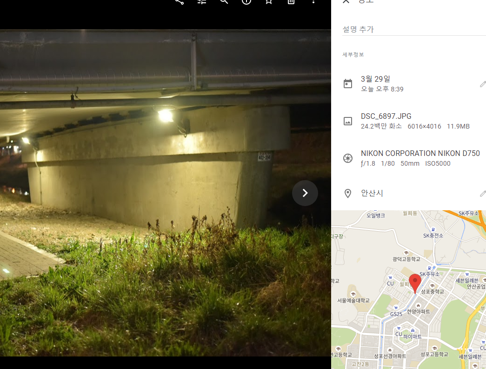
구글 포토 등으로 조회한 결과입니다. 심지어 구글지도 포토라인에도 사진이 잡혀 들어갑니다.

