category: Dev
tags: [AWS, CodeSuite, CodePipeline, CodeBuild, CodeCommit, CodeDeploy]

## 서론
현재 업무상 AWS에서 돌아가는 jsp앱과 node앱들이 존재한다. 
기본적으로 Node계열은 스크립트로 전부 배포까지 자동화 되있는 상태고 딱히 협업구조는 아니라 제외하고 jsp계 메인 사이트의 경우 기존에 ec2에 svn과 jenkins 를 띄워서 직접 관리하고 있는 구조.   

문제는 이 jenkins가 취약점 공격을 받아 마이닝 프로그램을 실행하는 프로세스가 계속 돌도록 공격받았다. 일단은 ec2나 그 외 보안조치로 인해 실질적인 피해는 없지만 신뢰를 모두 잃은 상황에서 AWS에서 CodeBuild, CodeDeploy를 이용해 jenkins를 대체, 나아가 자체 구축된 svn도 git 기반은 codeCommit으로 변경하기로 했다. 물론 제안부터 작업까지 내가...  

각각 서비스에 대해서야 많은 곳에서 설명은 해두었으니 실 구축했던 내용이나 기록해본다.

**github에서의 사용이나 좀 전문적인 사용보단 AWS CodeSuite만을 사용하는 기본적인 방법만 언급.**

## [CodeSuite](https://ap-northeast-2.console.aws.amazon.com/codesuite/)
기록하기 앞서 간단하게 말하자면 일단 저 자잘한 각각의 서비스는 모두 동일한 업무에서 순서대로 사용되는 흐름을 가지고 있고 이를 AWS에서는 CodeSuite라고 명명하여 한번에 관리한다.(관리 콘솔 내에 나머지 4개가 서브메뉴로 구성됨)  

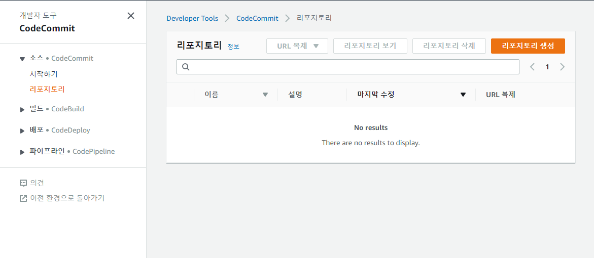

##  CodeCommit
CodeCommit은 git 기반 비공개 저장소이다. 물론 지금은 github도 프라이빗을 무료제공하기 시작하긴 했다만 일단 AWS에서 직접 관리하는 서비스다보니 CS 내 다른 서비스에 모두 호환하는데 아무런 고려를 하지 않아도 자연스럽게 되는 장점이 있으나....  
단점은 CodeSuite는 리전구분이 있어 타 리전에는 접근이 되지 않는다. 쉽게 말해 **서울리전에 CodeBuild나 CodeDeploy는 서울리전 외의 CodeCommit에 접근할 수 없다...**  
내 경우가 이 경우인데 deploy 설정할때 깨달아서 망ㅋ함ㅋ  
**단, CodePipeline에서 빌드 스테이지를 선택할때 타 리전이 선택 가능한데 이걸 쓰면 접근 가능할 지도 모르겠다(해보지 않음)**

아무튼 업무상 가장 먼저 한 작업은 기존 svn관리중인 프로젝트들을 CodeCommit으로 이전하는 작업. 
사실 어렵진 않다 프로젝트 내 .svn을 제거하고(svn 링크 끊김) CodeCommit의 리포지토리를 생성해서 주소로 연결해주면 끝. Git 사용 자체에 대한건 패스하자.

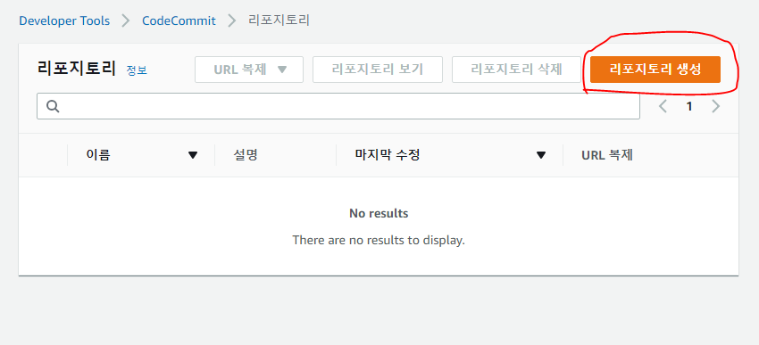
- 생성을 눌러서  

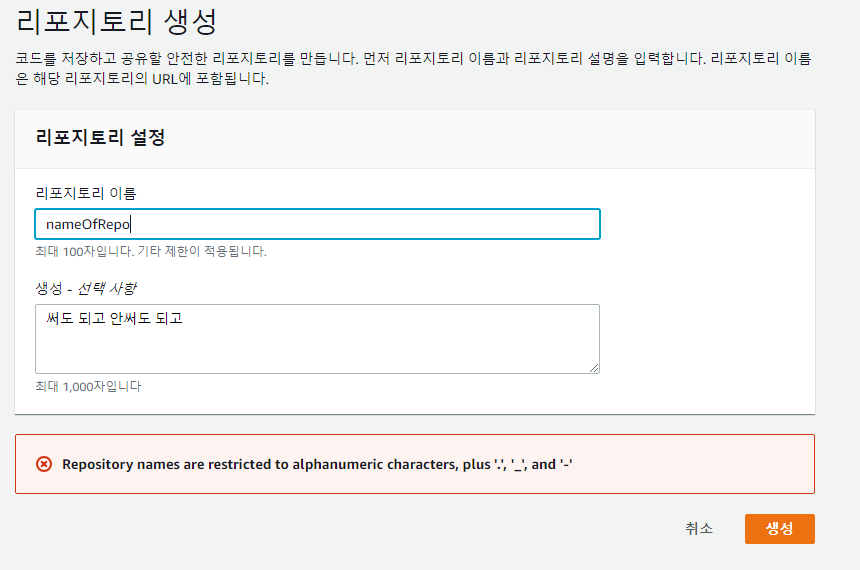
- 밑에 에러는 알파벳 안써서 난건데 이름은 영숫자+(._-)만 된다

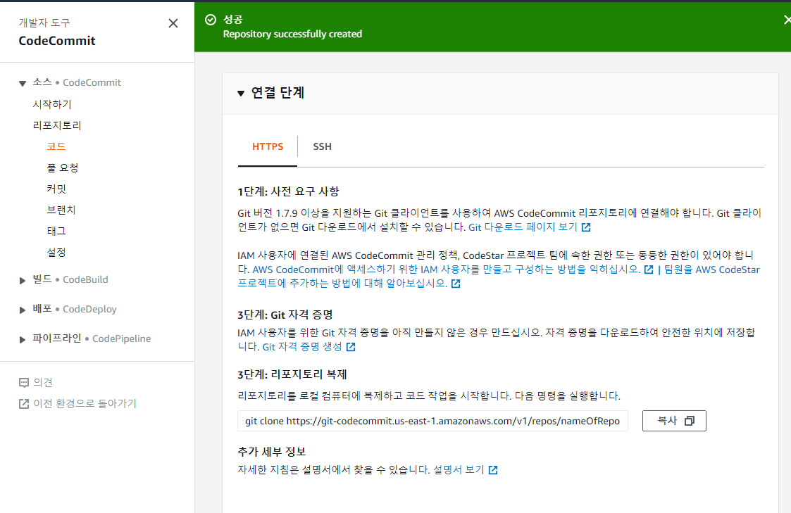
- https(url)과 ssh 방식 모두 지원한다. 
- 주의할 점은 Git 자격 증명부분. commit, push를 위한 인증을 aws답게 별도로 자격을 만들어야만 사용할 수 있게 해놨다.(aws 계정 아님) 
    - 내 보안 자격 증명 - 사용자 - 보안자격 증명 에 가면 액세스키라던가 CodeCommit에 대한 ssh, https 키를 생성할 수 있으며 해당 정보를 다운 받을 수 있다. 
    - 일단 잊어버리면 다시 만드는 건 되지만 귀찮고, 다시 조회할 방법은 없으니 까먹지 말자.
        

기본적으로 git을 써봤다면 문제 없음. pull request나 브랜치나 태그, 커밋 히스토리도 콘솔에서 볼 수 있고 일반적인 git client에서 사용도 전혀 문제 없다. 

##  CodeBuild
CodeBuild는 각 플랫폼(Node.js, Java 등)별로 output을 만들어 주는, 말 그대로 build 작업을 해주는 서비스이다. 대략 별도의 vpc를 만들고 소스를 빌드해서 아웃풋(artifact라고 부름)을 만들고(전송하고) 닫는 형태로 보인다.   
즉, 라이브러리나 별도 세팅들에 대해서 사전에 정의 해주어야 하며 사실 실무상 이걸 구성하는게 가장 어려운(귀찮은) 일이었다.(아래 CodeDeploy도 동일.) 
콘솔로 생성이나 수정할때도 할게 좀 많다 일단 사진보면서 가보자 

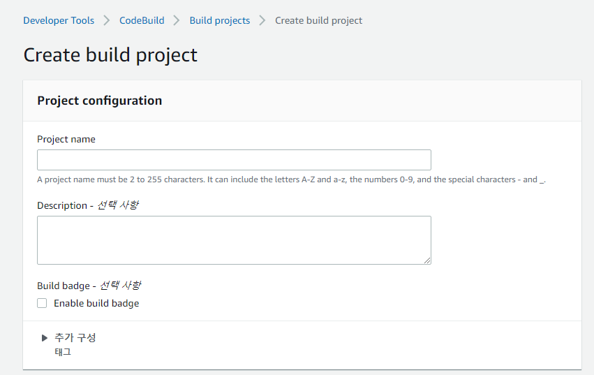
- 생성을 누르면 맨 위 설정. 이름과 설명을 적자

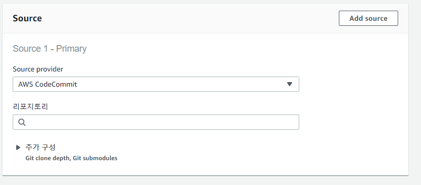
- 빌드할 소스 위치를 설정하는 곳.   
- S3나 깃허브도 가능하며 자기네 서비스니 CC가 먼저 세팅되있긴 하다.  
- CC기준 리포지토리가 자동완성으로 제공하긴 하는데 다른 리전 CC는 가져올 수 없게 되어있다.
   멀티 리전 서비스라면 걍 GitHub 쓰면 될듯.  
- Github인 경우 인증정보(OAuth나 Token)을 입력해서 연결하게 되어있음.  
- 선택사항은 git depth나 뭐 submodule 설정(선택)  

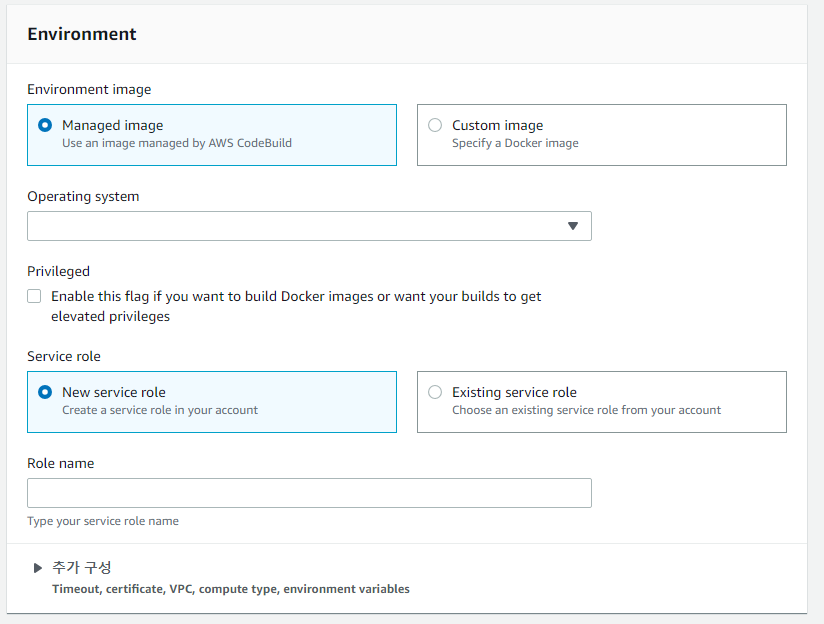
- 환경 설정. 중요하지만 간단하다. 
- 도커를 쓸지 자체 이미지(ec2의 이미지를 생각하면 맞는듯) 선택 후 OS나 도커 환경을 선택(리눅스나 윈도우)
- 서비스 롤은 그냥 New로 자동생성 시키자. 다만 단일 롤로 여러개를 만들면 Existing을 선택하고 사용할 롤을 선택하면 됨. New라면 롤 네임은 무시하자.
- 추가구성에는 사용할 VPC 컴퓨팅 세팅이나 타임아웃, 인증정보나 뭐 잘 모르면 냅두면 되는 것들이고, 간혹 필요한 환경변수를 설정할 수 있다. Node 서비스 같은 경우 환경변수 쓸 일이 많은데 저기다 많이 할당해 놓기 보단 dotenv로 퉁쳤다(서비스 내역 날아가는걸 염두에 두면 파일로 보존하는게 좋다 봄)

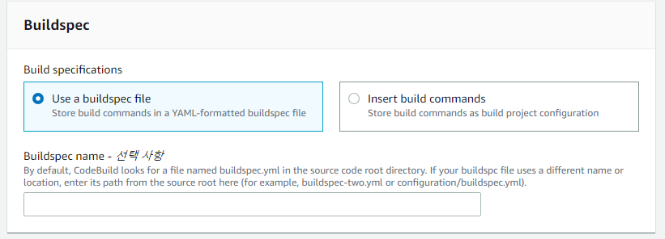
- 빌드 스펙. CodeBuild의 핵심으로 **매우 중요**하다
- 일단 묻지도 따지지도 말고 저렇게 두자. (기본값)
- 스펙을 파일로 주냐 저기다 설정으로 넣냐 인데 서비스 해킹 등으로 인해 해당 서비스가 날아갔을떄 파일로 보존된 스펙이 복구에 얼마나 도움되는지 조금만 생각해보면 알듯.
- 스펙 파일은 프로젝트 루트에 buildspec.yml 파일이나 경로나 이름을 변경할 경우 name을 바꿔주면 된다. 
- 스펙 파일은아래 다시 설명.

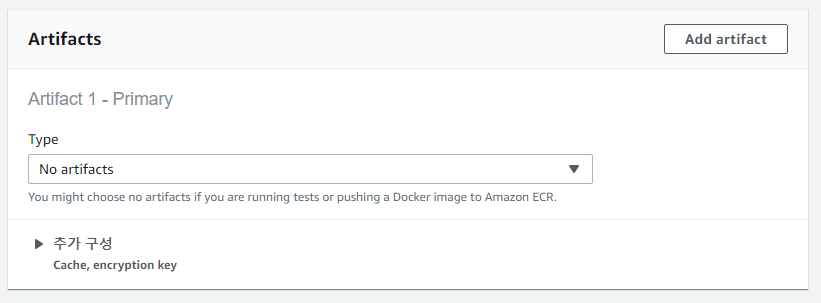
- 아티펙트 설정 CodeBuild의 목적으로 역시나 **중요**하다.
- 빌드한 결과를 어떻게 할 것인가인데 S3저장, 없음(작업 안함)으로 나뉜다.
    - S3인 경우 버킷, 저장 경로, 저장 파일 이름, 압축여부 등을 설정하면 된다. 
    - 없음은 자체 스크립트로 직접 저장/전달 하거나 테스트이거나 등등.. 상황에 맞게 설정하자.
- 추가구성은 암호화와 cache인데 암호화는 뭐 기본이 아니니 패스하고 cache는 살짝 설명이 필요하다.
    - 매번 VPC를 생성해서 빌드환경을 만들고 빌드하고 아웃풋을 저장하는 작업은 초기 라이브러리 설치 등에 생각보다 많은 시간을 할예한다. 이는 빌드 시간별로 과금되는 체계상 좀 비효율적이라서 사용되는 라이브러리등 초기 설치 파일들을 캐쉬로 저장하는 기능. 
    - S3에 버킷, 경로만 저장해주면 첫 빌드 후에는 해당 경로에 캐쉬파일을 저장해서 초기화-라이브러리 다운- 라이브러리 설치-진행 이던 순서를 캐쉬로드-진행 압축해준다. 시간도 확연히 줄어드니 maven이라던가 node_modules 같은 단어와 관련되 있다면 해주는게 정신 건강에 좋다.(5분이 50초가 되는 매직을 볼 수 있음) 

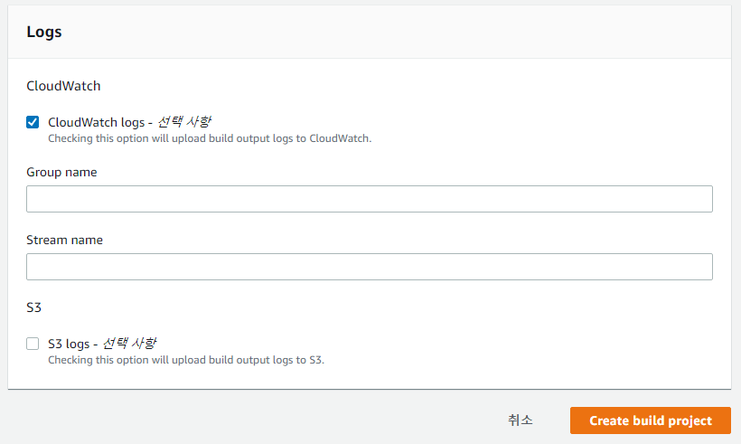
- 로그 설정. S3에 별도로 저장하겠다면 별도로 설정해주는데 그냥 CloudWatch만으로 크게 문제 없는 듯 하다. (다 돈이다...)

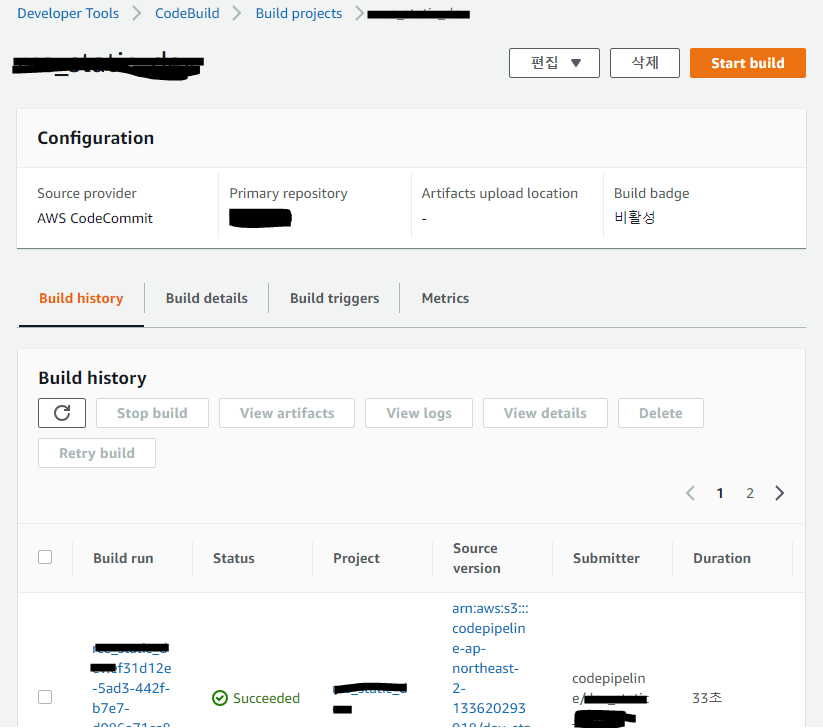
- 만들어진 프로젝트를 들어가보면 대충 저런 화면이다. 
- 편집은 위에 했던 '그 것'들을 다시 설정하는거고, start build는 빌드 실행(설마 따라하는 사람이 있을까 싶지만 따라하면 fail뜸)
- 아래는 실행 이력(실행로그까지)이나 설정 확인, 트리거 설정 등을 확인 가능하다. 

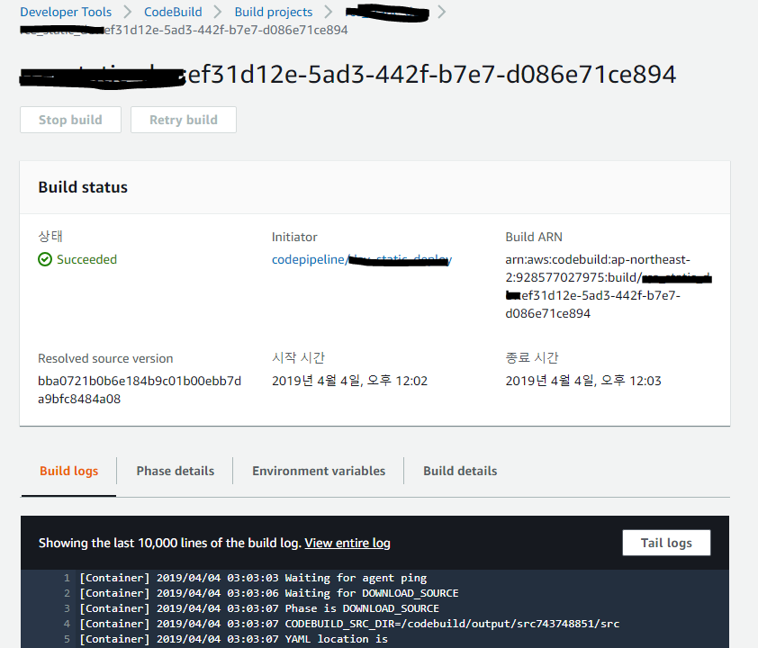
- 실행을 하면 뭐 자잘한(이미 설정한) 소스위치나 환경변수를 다시 설정하는 창이 나오는데 그냥 다시 확인 누르면 요런 화면이 나온다.(위에 history에서 이력을 클릭해도 동일한 창)
- 스텝에 따라 상태는 변하고 최종적으로 succeeded나 fail로 뜨고 기본 정보들 그리고 아래 VPC에서 실행되는 로그가 tail되서 실시간으로 출력된다.(이력은 풀로그 제공) 
    - 처음 맨 땅에 헤딩할 때 가장 맘에 들었던 부분. 내가 뭔가 빼먹으면 에러 메세지가 바로 나오니 조치할 수 있었다.

### Build Spec.yml
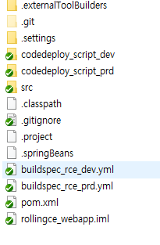
- 작업이 모두 끝난 프로젝트의 루트. 일단 한 소스에서 dev와 prd로 구분해서 빌드, 배포하기 때문에 name을 따로 설정해 준 상태이다.   
[빌드스펙에 대한 AWS 가이드](https://docs.aws.amazon.com/ko_kr/codebuild/latest/userguide/build-spec-ref.html)  

일단 가이드도 있지만 잘 모르겠으니 자잘한 세팅은 제거한 실제 동작하는 파일은 아래와 같다.
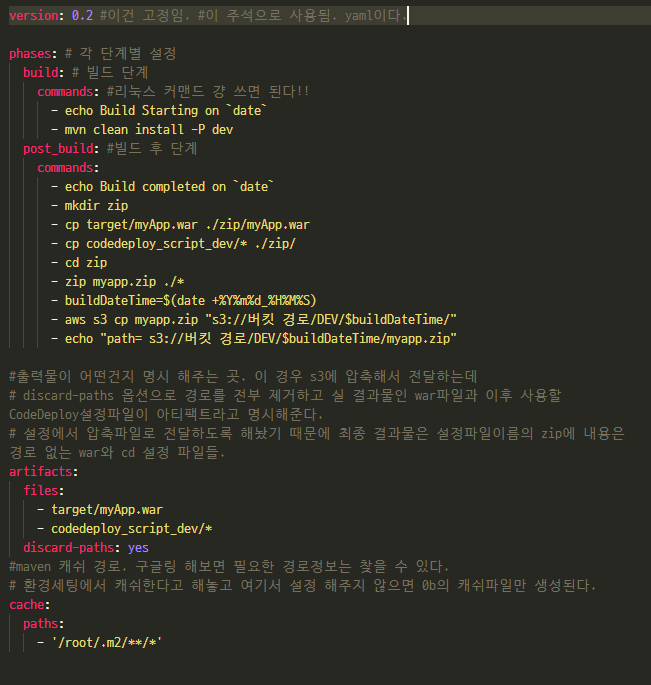
- 간단히 말해서 소스수정 다 끝내고 war나 빌드파일 만들때 cli로 작업하는 순서대로 쭉 적어놓으면 되고, 스탭이나 옵션은 위 가이드를 참조하자. 
- 가장 많이 쓰는게 install, pre_build, build, post_build 스텝(순서대로임) 이다. 각 스탭별로 해야되는거나 할수 있는게 약간씩 다르니 가이드는 한번 읽어보고 작업해야 된다.(삽질 할 일이 많은 구간임) 

세세하게 할게 좀 많긴 한데 일단 이정도만 하면 빌드 상태 succeeded는 볼 수 있을 것이고 설정한 버킷에 아티팩트를 볼 수 있을 것이다. 

# 아래는 좀 나중에 이어서 적자(...) 넘 길다

##  CodeDeploy(적을거 짱 많)
CodeDeploy는 말 그대로 빌드된 파일을 운영 서버 등으로 배포(deploy)해주는 서비스이다. 
구조 자체는 좀 불편한데 어플리케이션-배포그룹 안에서 배포를 관리하는 depth가 하나 더 있는 구조인데 개인적으로는 아직 왜 이런지 모르겠어서 약간 불편하다. 앱 안에 dev와 prd로 관리하곤 있다. 

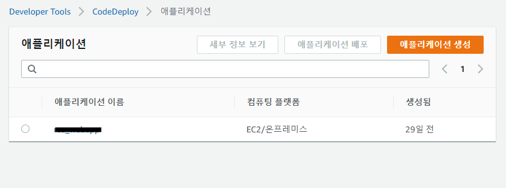
- 생성 누르면 생성(운영중인 곳이라 생성된 애플리케이션이 하나 있다.)  

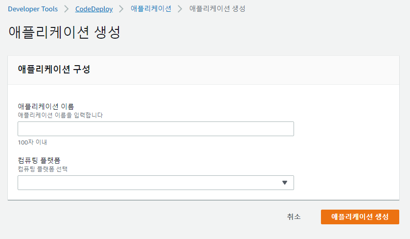
- 애플리케이션은 그냥 이름과 플랫폼만 설정하면 된다. 
- 플랫폼은 EC2, 람다, ECS로 구분되는데 EC2와 람다인 경우 사용료는 공짜다(갓갓)

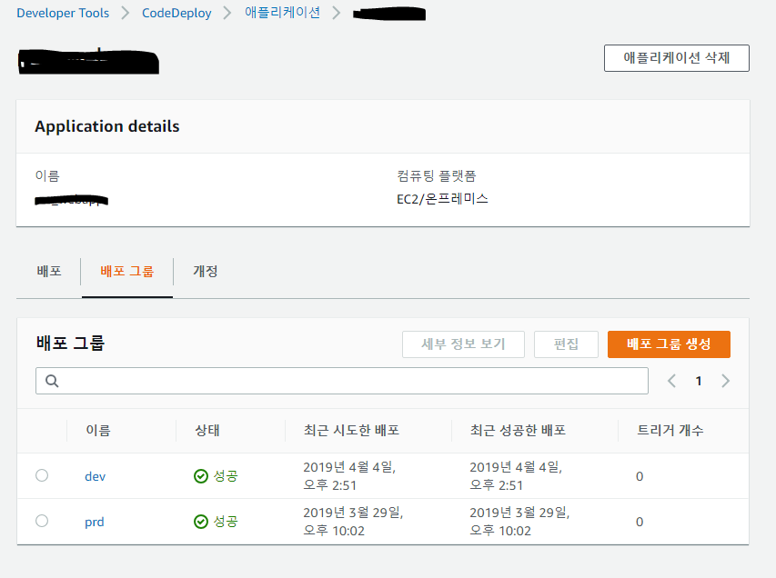
- 생성된 애플리케이션을 선택하면 나오는 화면.
- 배포된 이력들, 생성한 배포그룹, 개정 정보를 볼 수 있다. 
    - 이력은 배포그룹 통합이다.
    - 배포그룹은 생성하여 거기서 세부 배포를 실행한다. 
    - 개정은 단어가 좀 이상한데 쉽게말해 운영서버에 배포된 소스(빌드 결과물)이라고 생각하자. codeDeploy는 롤백 등 버전 관리를 위해 이력을 쌓아두고 있다.

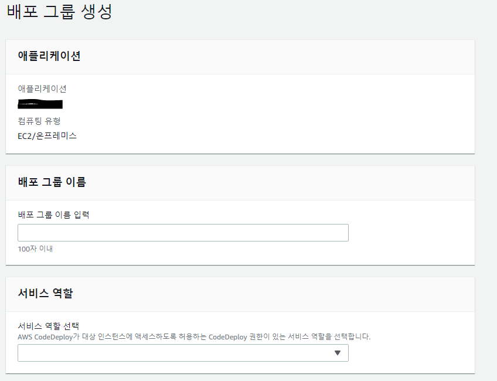
- 배포그룹 생성을 누르면 주루룩 나오는 창1. 할게 많다. 
- 일단 이름부터 입력하고, 서비스 역할은 service role이다.
    - iam에서 역할에서 AWSCodeDeployRole 정책을 부여하여 하나 만들어두고 돌려써도 될듯. 
    - S3등 접근이 필요한 경우 해당 역할에 함께 부여하자

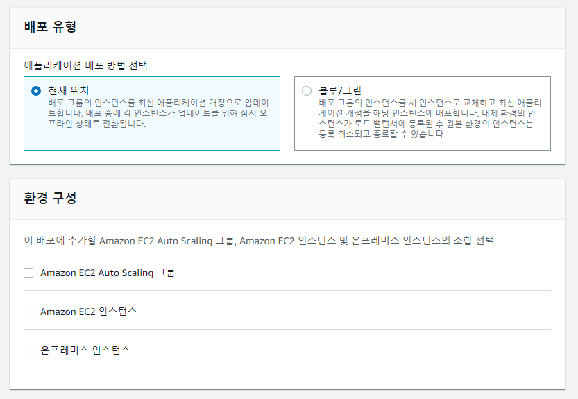
- 배포그룹 생성을 누르면 주루룩 나오는 창2.
- 배포유형과 환경구성부분. 환경구성은 해당하는 것을 선택하고 관련 설정을 해두면 된다.
    - 내 경우 EC2였는데 주의점은 deploy를 위해서는 아래 작업이 필요하다(여긴 가이드 보면서 따라하자) [AWS 전체 가이드](https://docs.aws.amazon.com/ko_kr/codedeploy/latest/userguide/instances-ec2-configure.html)
        - ec2에 iam 역할 생성하여 연결. 
        - 해당 iam 역할에 엑세스 권한 부여(s3라던가...)
        - ec2 태그 지정. 에초에 태그로 접근하는 구조라서 ec2가 여러개라도 동일 태그면 한번에 배포 가능하다
        - 별도의 agent를 해당 ec2에 설치. 가이드 따라가는게 제일 안전함. [AWS 설치 가이드](https://docs.aws.amazon.com/ko_kr/codedeploy/latest/userguide/codedeploy-agent-operations-install.html)
            - agent 경로가 리전마다 다른데 타 리전껄 설치 했더니 오류났었음.
    - 이부분이 사실 처음 하는 입장에서는 제일 복잡했다. 심지어 보안상 EC2 터미널 접근을 막아놨던 터라 다시 풀고 들어가서 설치하고 테스트하고...
- 배포 유형은 기본과 b/g배포. 배포전략부분인데 이쯤 오니 슬슬 배포 전략이라던가 관련 지식이 필요하긴 하다. 그래도 일단 구축이 먼저니깐 하고 공부중(...)
    - 기본(현재위치)는 인스터스 연결을 끊고 배포하고 연결한다. very simple 문제는 중간에 접속이 끊긴다는 점.
    - b/g의 경우 ci/cd 측면에서 여러개의 서버에 순서대로 배포하는 전략과는 달리 라우팅 바꿔치기를 이용하는 방식으로 대략적인 순서는 아래와 같다. 중단없고, 문제 있으면 원본 인스턴스(블루)는 그대로 두면 되니깐 복구도 간단한 편.
        - 인스턴스를 복제 - 임시 도메인으로 복제본(그린) 연결/배포 - 원 도메인에도 그린 연결 - 원 도메인에서 원본(블루) 제거 - 임시 도메인 제거
    - 자세한건 나중에 글을 쓰든 구글신께 문의하자 일단 구축이 먼저다ㅠㅠ

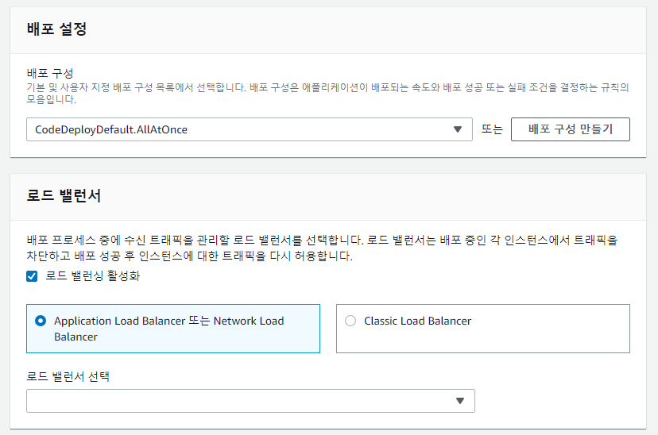
- 배포 설정. 인스턴스가 1개 이상인 경우 해당 인스턴스 들에 어떻게 배포할 건지에 대한 서정이다. 
    - 한번에 다(AllAtOnce), 한번에 (최소)하나씩(OneAtTime), 한번에 절반씩(HalfAtATime). 
    - 단일 인스턴스면 AllAtOnce로 하면 됨.
- 로드 밸런서 설정. ec2에서 지원하는 CLB로 지정하거나 비활성화 하거나 이건 각자 상황에 맞게...

그 외 고급- 선택사항의 경우 트리거, 경보, 롤백 설정인데 몰라도 상관없고 이걸 알정도면 굳이 이거 안보고도 할수 있을테니...

여기까지 하면 환경에 대한 설정은 끝이나 배포는 아직 안된다. CodeBuild에서 잠깐 언급했는데 CodeDeploy 역시 설정파일을 요구하는데 여긴 파일명이나 경로를 수정할 수 없고 무조건 루트에 appspec.yml과 관련 커맨드 파일들을 위치 시켜야 하고, 개정 파일은 단일이므로 당연히 압축되어 있어야 한다. 
정리하면 zip 단일 파일로 개정이 준비되야 하고 압축파일 안에는 아래와 같이 되어 있어야 한다.(본인은 리눅스이므로 .sh파일이 들어있다.)  
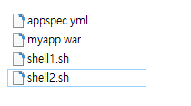

appsec.yml 은 일단 [AWS 가이드](https://docs.aws.amazon.com/ko_kr/codedeploy/latest/userguide/reference-appspec-file.html) 한번 읽고 시작하자

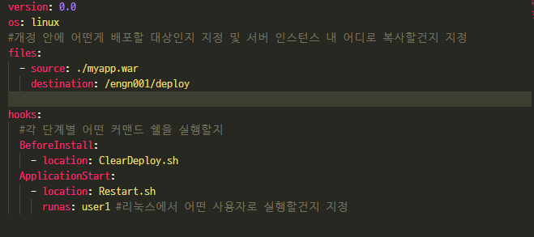
- 개발서버 배포용 appspec.yml. 가장 중요한 두 항목(files, hooks)이다. 
- 보면 알겠지만 역시 배포도 스텝별로 진행되며 각 스텝별로 실행할 리눅스 커맨드를 sh로 작성하여 실행해주므로 리눅스에서 cli로 하는 행동은 '거의 다' 할 수 있다고 보면 된다.
- 일단 Install이 개정을 인스턴스로 옮기는 행동이며 이건 사용자가 제어할 수 없으므로 이 전후로 뭔가 작업해주면 될 듯. (복사전에 해당 경로 파일들을 삭제하거나 서버를 멈추고 끝날때 서버를 재실행 등)

아무튼 이정도까지 하면 배포 실행해서 성공 메세지를 볼수는 있을꺼다 (아마...)  
다만 CodeBuild에비해 CodeDeploy는 어느스텝에서 무슨문제가 있는지 잘 안알려준다.(할려면 로그 세팅 따로 해야됨.)

##  CodePipeline 
사실 위 단계들이 전부 성공했으면 구축, 실행에 아무런 문제는 없다. 
요금에 대해서는 일단 파이프라인당 1달러인데 생성 후 첫 한달은 무료이다. 그리고 파이프라인자체가 30일 이상 동작하지 않으면 요금이 나오지 않는다고 한다. 다만 필요에 따라 끄고 키는 기능이 없는데 이건 아래에 다시 언급하겠지만 **변경감지 자체를 일시정지하여 동작을 방지하는 방식으로 우회할 수 있다.(미세먼지 팁임)**

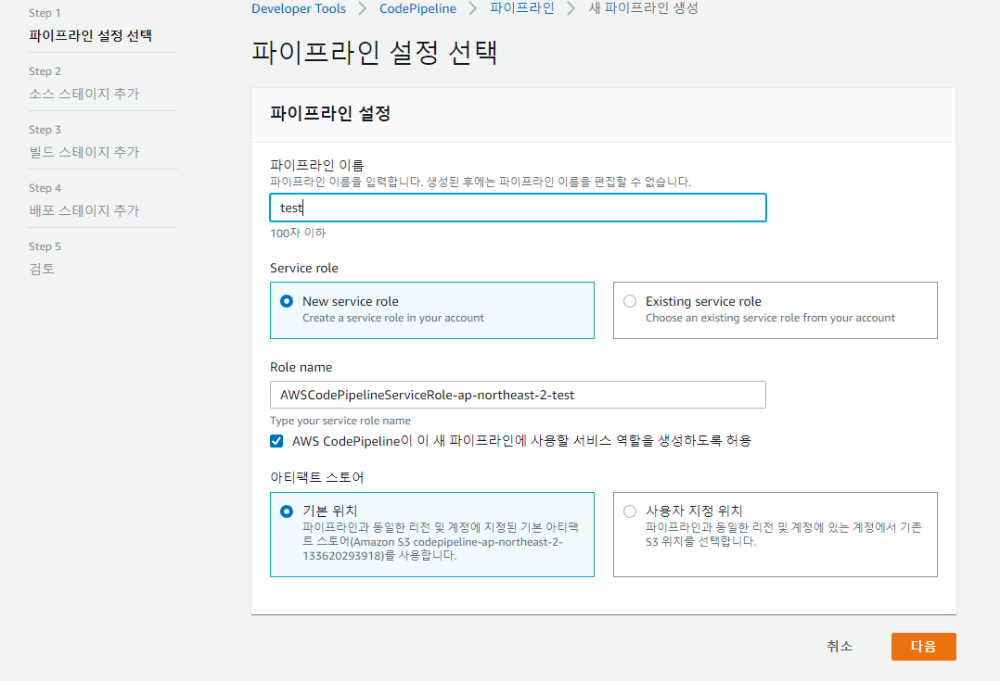
- step1. 파이프라인 설정
- 비슷한걸 계속 반복해서 설정하는데 이름쓰고 서비스롤 만들지/지정할지 선택. name은 new면 자동으로 세팅된다.
- CodePipeline 전용 버킷을 만들지 기존 S3를 지정할지인데... 다시 이야기 하겠지만 그냥 기본 위치 쓰자.. 사소한 문제들이 있다.

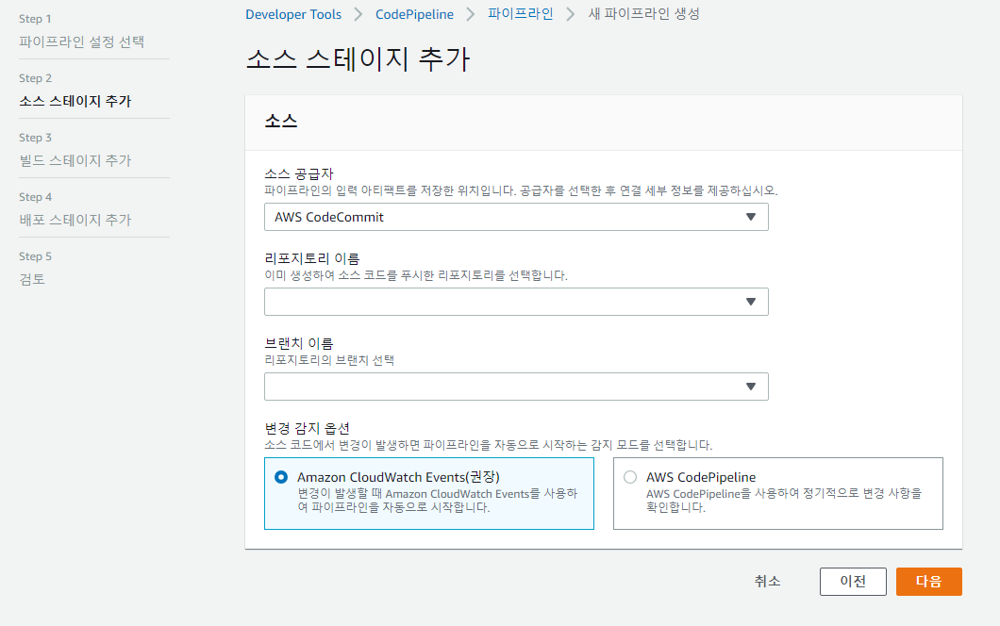
- step2. 소스 스테이지
- CodeBuild에서와 유사하게 공급자나 저장소, 브랜치를 설정한다.
- 변경감지 옵션은 이벤트 방식과 풀링 방식이라고 보면 된다. 둘다 일시중단도 가능하다(요금을 위해)

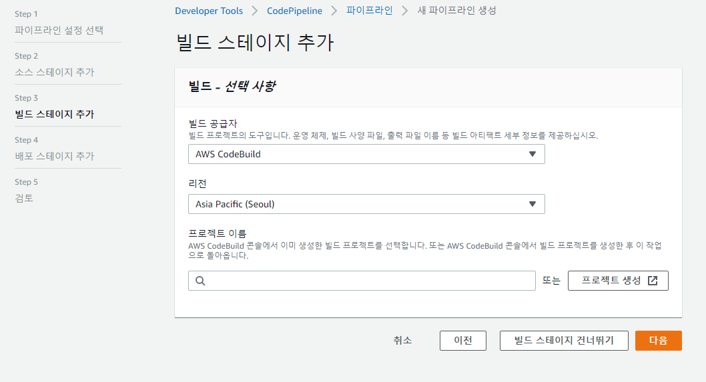
- step3. 빌드 스테이지
- 참고로 빌드와 배포 스테이지는 스킵이 가능하다. 이벤트가 소스커밋이벤트에 반응하여 감지하므로 소스는 필수인듯. 에초에 목적이 소스 올리고 파이프라인 따라 자동화 하는거니 당연한듯. 다만 최소 2 스테이지는 필수로 포함되어야한다(Pipeline 존재의미니..)
- CodeBuild와 Jenkins중에 선택해도 되고 넘어가도 된다. CodeBuild면 딱히 할 설정이 없고 jenkins는 안해봤으니 패스(무책임)

- step4. 배포 스테이지
- 공급자가 상당히 많다. AWS에 유사한 많은 배포서비스들을 다 끌어올 수 있는 건 장점.
-  CodeDeploy 기준으로 리전, 애플리케이션, 배포그룹만 설정하면 끝난다. 

##  결론
주 업무도 아니고 처음 해보는 입장에서 좋다는 소리만 듣고서 & AWS로 회사 시스템을 이전하기 위해 시작하기엔 워낙 범위가 넓은(개발 소스 버전관리~~ 운영 배포.) 서비스라 다소 부담되긴 했다. 개별  막상 구축해놓고 정리해보면 정말 별거 없다. 다 편하게 쓰라고 만들어놓은거니 쫄지 말고 들이받아보자. (약간씩 요금부담되는건 별수 없지만)