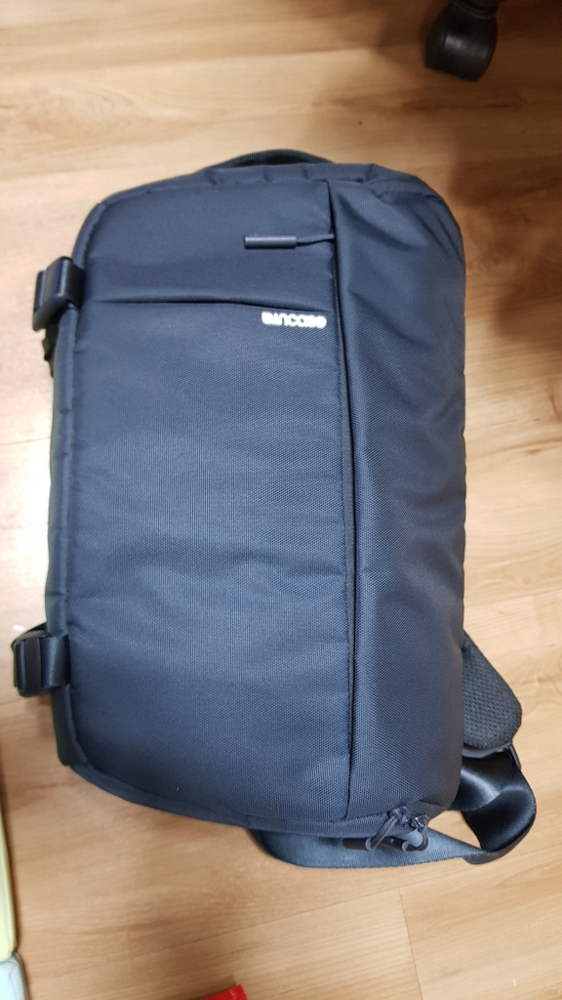
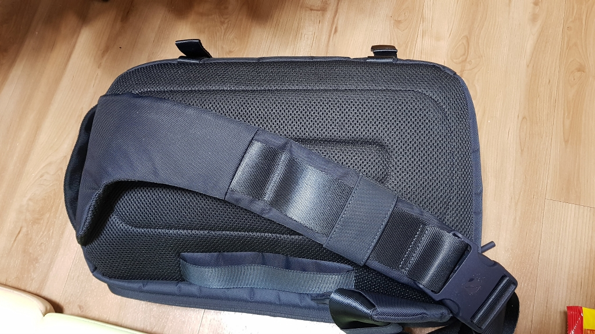
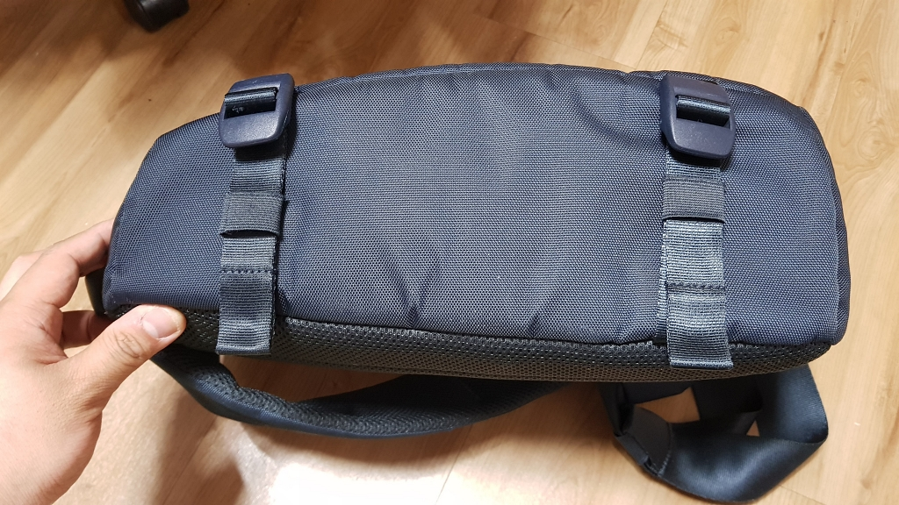
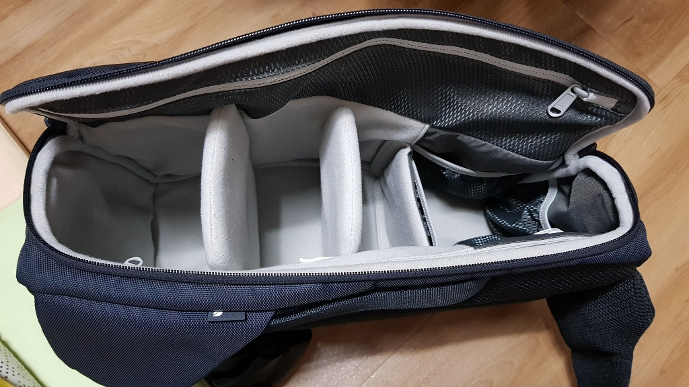
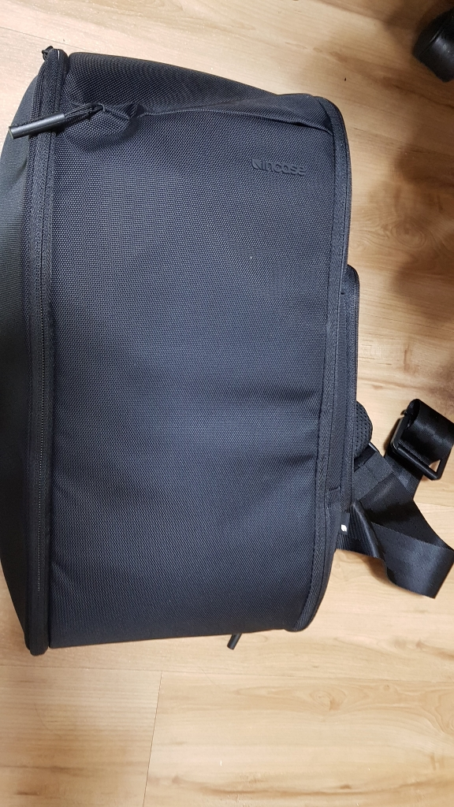
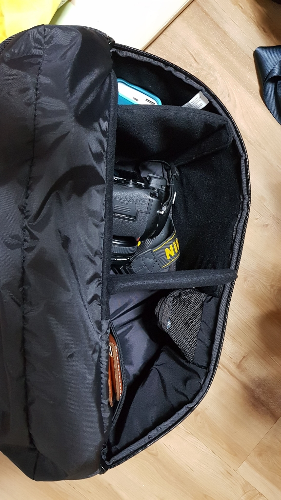
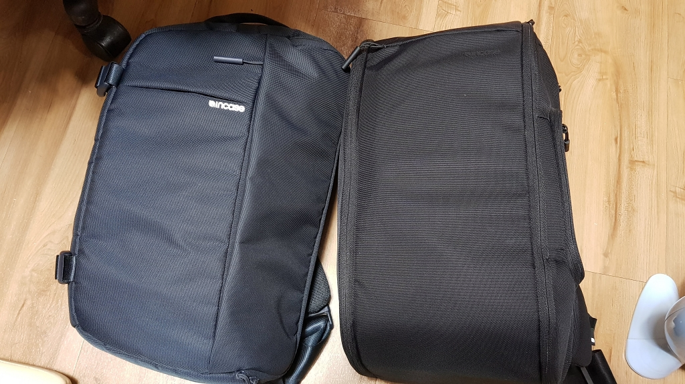
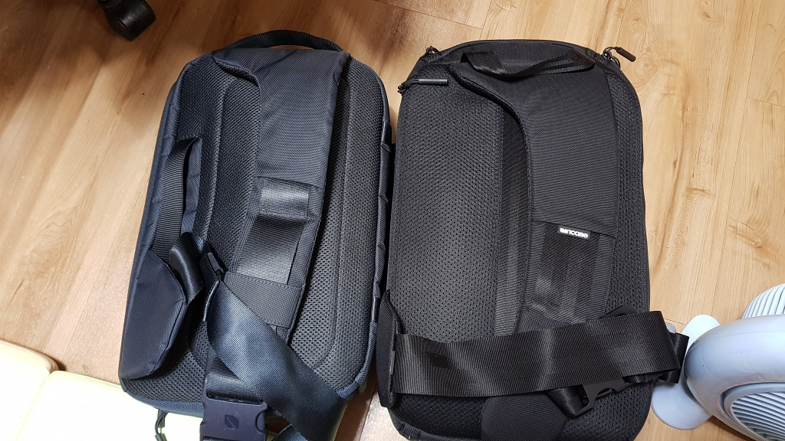
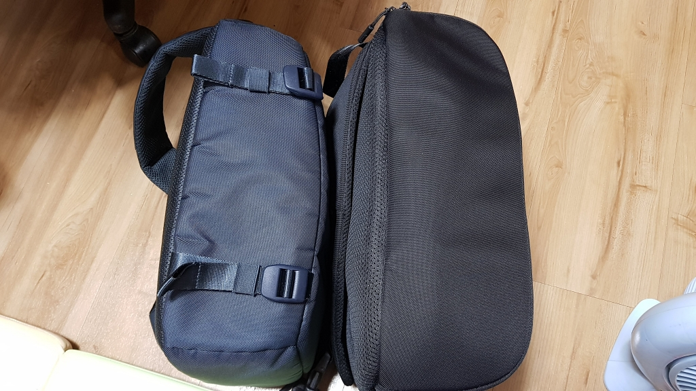

category: Review  
tags: [Review, Incase, DSLR, SlingBag, SlingPack, Sling, 인케이스, 가방, 리뷰,Capture Camera Sling Pack,DSLR Sling Pack]

# 인케이스 카메라용 슬링백 2종 비교(?) 리뷰

## 상품 상세 링크 
[캡쳐슬링팩: Capture Camera Sling Pack](http://www.incase.kr/shop/shopdetail.html?branduid=2558901)  
[슬링팩: DSLR Sling Pack](http://www.incase.kr/shop/shopdetail.html?branduid=2559651)

제목엔 슬링백이라고 적었지만 영문명을 보면 알겠지만 bag이 아니라 pack이다. 백팩처럼....  
그러니 본문엔 슬링팩과 캡쳐슬링팩으로 줄여 쓰겠다.

## 서론
멀리나가는 DSLR용 백팩은 있고 좀 더 사진을 데일리로 하기 위해 슬링팩을 1년전부터 쓰고 있던 터였다.   
내 조건은 1바디(D750), 렌즈 1~2개, 노트북(13인치가량)+ 자잘한 물품 수납, 그리고 바로 꺼내고 넣기 위해서는 슬링 형태가 좋겠다 싶었다.   
당시에 아는 분이 슬링팩을 메고 다니는걸 보고 꽤 괜찮다고 생각해서 그걸 기준으로 검색했지만 마땅히 맘에 드는 것도 없었고, 11인치까지만 수납되는 모델이지만 구매해서 정말 잘(카메라 없이 그냥 데일리 가방으로) 사용 했었다.   

그리곤 요새 다시 사진관련으로 시작하려니 역시나 노트북이 아쉬운 상황.(근데 막상 노트북은 아직 미구매라는 게 함정)  

그러다 역시 다른 지인이 인케이스 ari 에디션(이것도 노트북은 무리)을 멘걸보고 혹 다른 모델이 있을까 싶어 찾아봤더니 역시나 있다.(캡쳐슬링팩. 각 정보는 위에 링크 참조)   

살까말까 고민하다 중고로 미개봉신품을 싸게 파는 분이 있어서 찾은지 하루도 안되어 직거래 완료 ㅋ 

슬링팩을 팔기위해 중고매장에 올려놨는데 일단 둘다 있는 김에 비교리뷰를 써보기로 한다.

## 본론
일단 슬링팩, 캡쳐슬링팩, 그리고 두개 비교삿 순으로 가보자.  
슬링팩은 아무래도 1년정도 데일리로 쓴거라 사용감때문에 빳빳한 느낌은 없다(느낌만 없지 단단함) 

### 슬링팩

  
앞모습. 딱 네모진것도 아니고 미묘한 각도가 있지만 이쁘장하다.  
앞쪽은 전체주머니라 넓고 얇음.

  

뒷 부분은 패드와 어깨끈 패드가 두툼한 편이다.(덥다...)   
어깨끈은 버클이 있어 분리도 되는데 소소한 특징으론 줄 길이가 고정이 단단하지 않다.  
즉, 뒤로 메다 앞으로 당기면 줄도 죽 늘어나는데 이게 카메라를 바로 꺼내기 좋은 특징으로 캡쳐슬링도 비슷한 형태로 되어있음.   
카메라 넣고 빼고 하는거 해보면 이게 단점이 아닌 이유를 알게 됨.  

  
세워놓으면 옆면, 가로로 놓을땐 밑면부분. 삼각대 결합끈이 있고 여행용이 아닌 내 삼각대도 무리없이 잘 결합되더라.(2번 써봤나...)

  
탈착되는 격벽은 총 3개(뚜껑있음2, 매쉬주머니1)이고 소지 장비에 따라 커스텀 하면 된다.   
다만 길이가 짧은 편이라 카메라를 넣고도 안에 좀 더 여유가 있다.

  
3개 넣으면 dslr 렌즈결합해서는 깊숙히 넣을 수 없어서 통상 격벽은 2개만 사용하는편이다.   
위쪽에는 보조베터리라던가 미니선풍기라던가를 넣고 다닌다. 그 외에도 문짝에 매쉬 주머니가 2분리 되서 들어있고 등쪽에 11인치 맥북까지 들어가는 파티션이 추가로 있다. 

### 캡쳐슬링팩

자 이제 새로 구매한 캡쳐 슬링팩을 araboja

  

인케이스 로고가 백과 같은 블랙컬러라 눈에 잘 안띄는 단점(?)이 있다.   
상단은 보관 실수였는데 대각선으로 접혀있는데 지금은 안에 신문지를 넣어 각잡고 있는 중.

  
이 모델의 특징은 숨겨진 가방이 엄청 많다는점. 하단부에 별도 가방이 하나 있고 뚜껑에는 소형 포켓으로 보이는 큰 구획이 있고 사진 아래 우측에는 튀어나온 메쉬필통같은 곳도 있고 전면부에도 보관함이 있다.   
위에 슬링팩에 있던 짐을 그대로 다 넣은 상태인데도 저정도 공간이 남기도 하고, 일단 13인치 노트북(ASUS ZenBook UX331UN 확인. 13.3인데 크게 무리없다. 15 맥북은 안된다함. 수치상 1cm정도 더 큰 14인치 젠북(UX433FN)도 될 것도 같기도 하고...)이 수납 가능하고, 가방 모양이 각이 딱 떨어져서(슬링팩은 입구쪽이 미묘한 사선이라 각도 안잡히고 사용감이 생기니 구분도 미묘해졌다.) 이쁘게 나온다. 

### 비교샷

전체적으로 캡쳐슬링쪽이 조금씩 큰 편.
   
우측이 열리는 부분인데 슬링팩은 로고 옆부분이 사선으로 내려져서 닫힌다. 캡쳐슬링은 직각.  

  
뒷판 매쉬와 패드는 캡쳐슬링팩이 더 두껍다. 그리고 노트북 보관 섹션이 외부로 나와있어서 노트북만 따로 바로 꺼낼 수 있다.   
슬링팩은 좌측에 손잡이가 있지만 캡쳐슬링은 없음. 단 중앙에 세로로 있는 안전벨트(?!)가 비슷한 용도로 쓸수 있게 해준다. 

  
슬링팩은 삼각대 결합부, 캡쳐슬링팩은 히든포켓이다.(상단 링크 참조)  
사용성에 차이가 있긴한데 히든포켓 생각보다 넓어서 장/단점이 아니라 특징으로 받아들여짐.  

## 결론

사실 저걸 비교한 경우가 적어서 올려놓은 거지 딱히 결론은 없다.   
굳이 따지자면 현재 슬링팩을 중고 매물로 올려놓은 상태인데 안팔려도 소장용으로 가지고 있을 생각이라....  
이제 가방도 바꿨겠다 새로운 맘으로 열심히 사진이나 찍어야 겠다.   
사진은 포트용 인스타그램에 올리기 시작하였고 상단의 인스타 링크를 달아 놓을 예정이다. 
